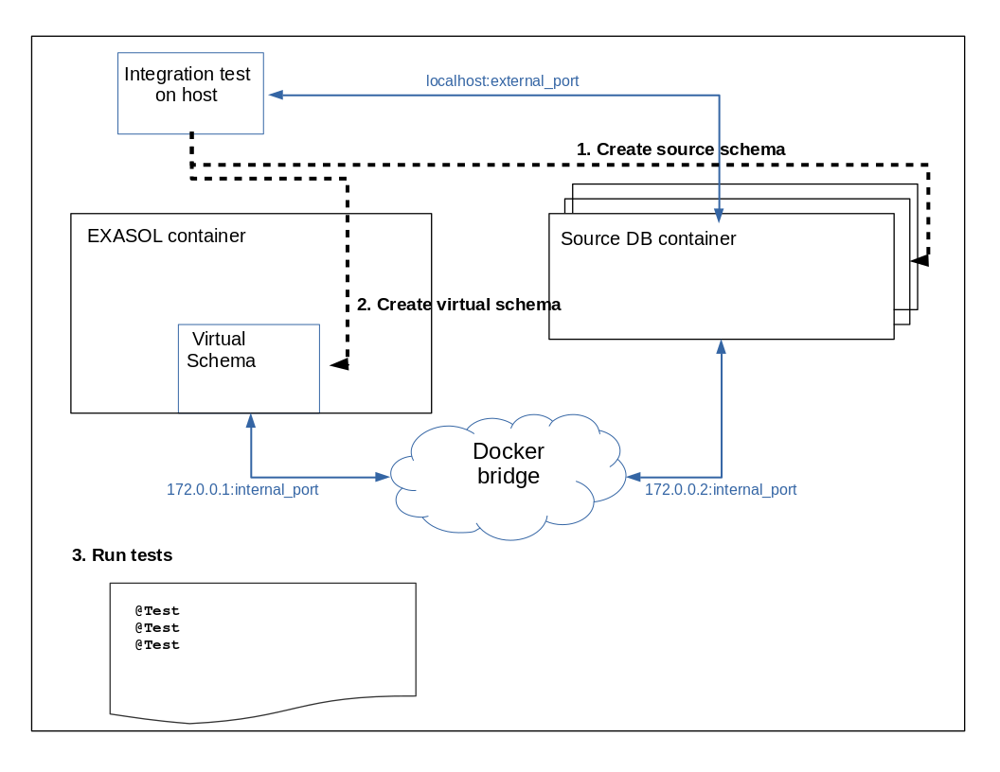

# Integration Testing with Containers

Virtual Schema integration tests use the `exasol-testcontainers` framework, which requires docker privileged mode to be available to run the tests.

## Overview

The idea of the container based tests is:

* Run the EXASOL and source databases in containers
* Prepare the test schema in the source database
* Create a virtual schema for the source database
* Run the tests on the virtual schema



## Prerequisites

What you need is, for each source database:

* A docker image with user you can connect to
* A JDBC driver for the database

## Preparing Integration Test

1. In order to run the automated integration test, add the `maven-failsafe-plugin` to the pom file
2. Provide a JDBC driver JAR for the source database.
3. Add a new Integration Test class for you database

### Provide JDBC drivers for the Source Database

The JDBC drivers should be deployed to an Exasol bucket during the test. Create a directory for holding the driver. For example: `src/test/resources/integration/driver`. The folder should contain the driver jar file(s) and a `settings.cfg` file. In order to connect to the source database from your integration test you also have to add the jdbc driver dependency to the `pom.xml`.

### Add a new Integration Test Class

Add a new class that has to:

* Create the test schema in the source database
* Create the virtual schema
* Execute the tests on the virtual schema. See [PostgreSQLDialectIT](https://github.com/exasol/postgresql-virtual-schema/blob/main/src/test/java/com/exasol/adapter/dialects/postgresql/PostgreSQLSqlDialectIT.java) for an example.

## Security Considerations

In order not to create security issues make sure the data in the source database is not confidential (demo data only).

## Executing Integration Tests

We use following [Maven life cycle phases](https://maven.apache.org/guides/introduction/introduction-to-the-lifecycle.html) for our integration tests:

* `pre-integration-test` phase is used to **automatically deploy the latest [JDBC](https://www.exasol.com/support/secure/attachment/66315/EXASOL_JDBC-6.1.rc1.tar.gz) adapter JAR** (based on your latest code modifications)
* `integration-test` phase is used to execute the actual integration tests

Note that to check whether the integration-tests were successful, you have to run the verify Maven phase.

You can start the integration tests as follows:

```bash
mvn clean package && mvn verify
```

Another way to run integration tests:

* Create a package of Virtual Schemas using `mvn package` command and run integration tests inside your IDE in the same way as unit tests.

## See also

* [Developing an SQL dialect](developing_a_dialect.md)
* [Remote debugging](remote_debugging.md)
